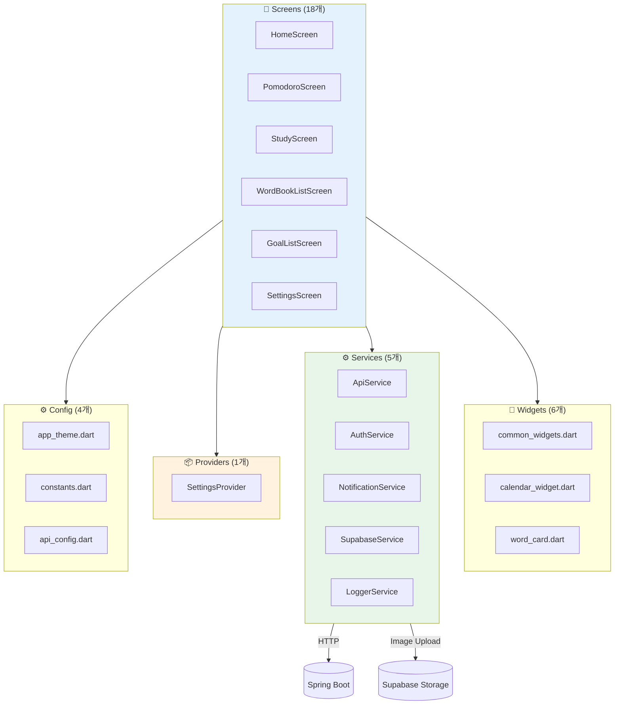
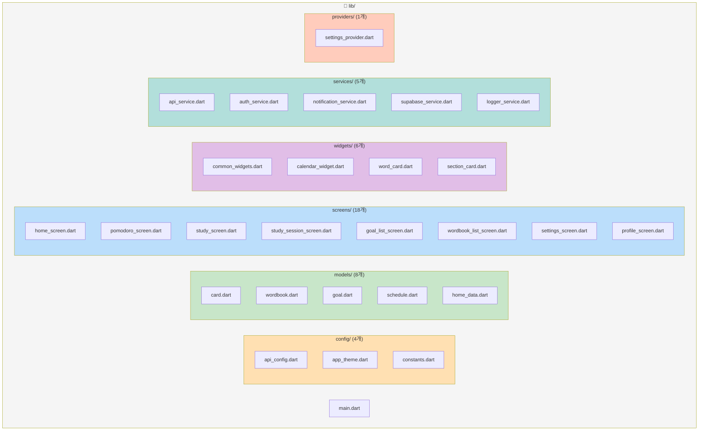
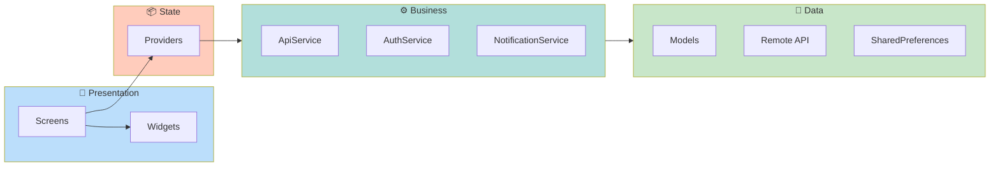
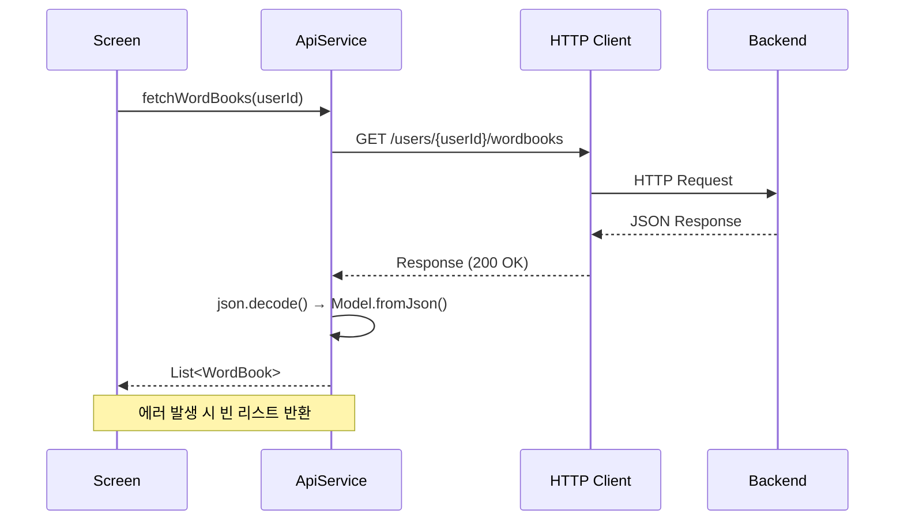
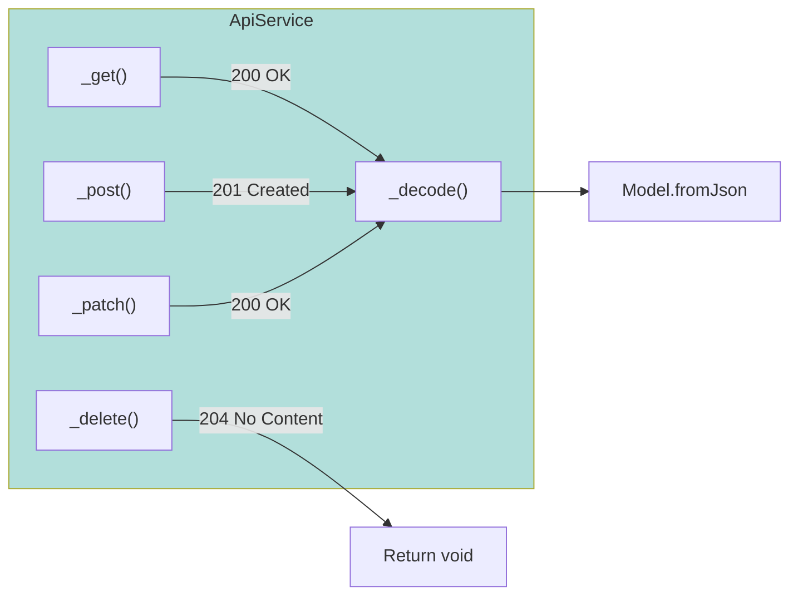
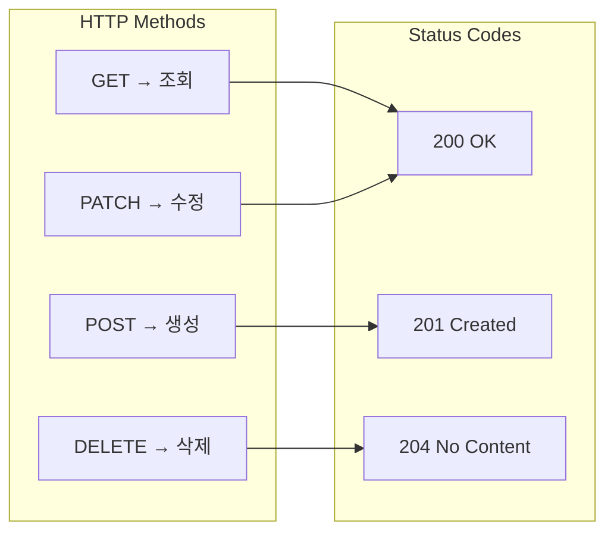
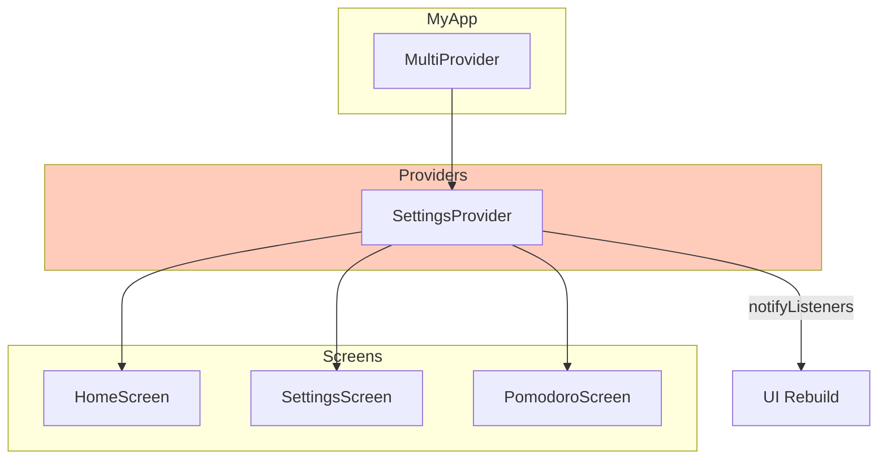
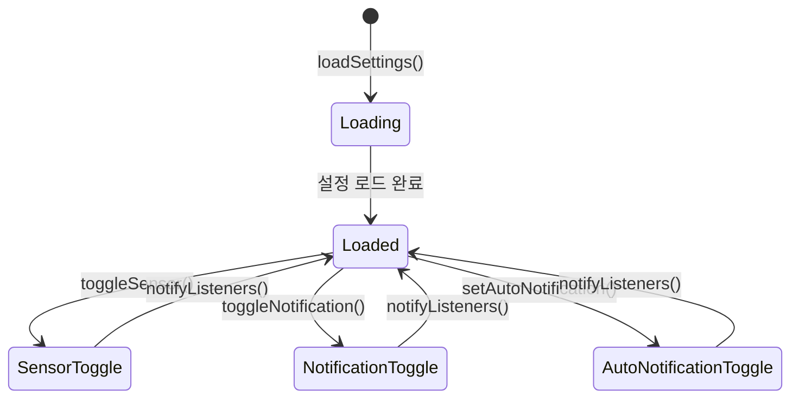

# CLAUDE.md

This file provides guidance to Claude Code (claude.ai/code) when working with code in this repository.

## Project Overview

LearnKit Flutter 프론트엔드 - 학습 일정 관리 애플리케이션의 모바일 클라이언트입니다.

**Tech Stack:**
- Flutter 3.9.2+
- Dart SDK 3.9.2+
- Material Design 3
- HTTP 클라이언트 (http 패키지)
- Provider (상태 관리)

**주요 기능:**
- 🎯 목표 기반 포모도로 타이머 (센서 감지)
- 📚 단어장(WordBook) 관리 및 우선순위 기반 학습
- 🃏 플래시카드(Card) 시스템
- 📅 스케줄 관리
- 📊 학습 통계 및 주간 요약

## Architecture Diagram



## Build & Run Commands

**패키지 설치:**
```bash
cd front
flutter pub get
```

**앱 실행 (개발 모드):**
```bash
flutter run
```

**특정 디바이스에서 실행:**
```bash
# 사용 가능한 디바이스 목록 확인
flutter devices

# 특정 디바이스에서 실행
flutter run -d <device-id>
```

**빌드:**
```bash
# iOS
flutter build ios

# Android
flutter build apk
flutter build appbundle
```

**테스트:**
```bash
flutter test
```

**코드 분석:**
```bash
flutter analyze
```

## API Configuration

백엔드 API 연결 설정은 [lib/services/api_service.dart:16](lib/services/api_service.dart#L16)에서 관리됩니다:

```dart
static String get baseUrl {
  return 'http://192.168.35.173:8080/api';  // 실제 기기용
  // return 'http://localhost:8080/api';     // 시뮬레이터용
}
```

**주의사항:**
- 실제 기기에서 테스트 시 Mac의 로컬 IP 주소 사용 필요
- WiFi 재연결 시 IP가 변경될 수 있음 (`ifconfig` 명령으로 확인)
- 시뮬레이터/에뮬레이터는 `localhost` 사용 가능

## Project Structure



### Layer Responsibilities



**Models:** 데이터 구조 정의
- JSON 직렬화/역직렬화 (`fromJson`, `toJson`)
- 불변 객체 패턴 사용
- 백엔드 DTO와 1:1 매핑

**Services:** API 통신 및 비즈니스 로직
- `ApiService`: RESTful API 통신 담당
- `AuthService`: 사용자 인증 관리 (현재 userId=1 고정)
- 에러 핸들링 및 기본값 제공

**Screens:** 전체 화면 단위 위젯
- StatefulWidget으로 상태 관리
- API 호출 및 데이터 로딩 처리
- 화면 네비게이션 관리

**Widgets:** 재사용 가능한 UI 컴포넌트
- 작고 집중된 단일 책임
- 부모로부터 데이터를 props로 전달받음
- 상태를 최소화하거나 제거

## API Service Pattern

### HTTP 요청 흐름



### HTTP Helper Methods



### Request/Response Pattern

모든 API 호출은 [lib/services/api_service.dart](lib/services/api_service.dart)를 통해 이루어집니다:

```dart
// ✅ Good: API 호출 패턴
static Future<List<WordBook>> fetchWordBooks(int userId) async {
  try {
    final response = await http.get(
      Uri.parse('$baseUrl/users/$userId/wordbooks'),
      headers: {'Content-Type': 'application/json'},
    );

    if (response.statusCode == 200) {
      final List<dynamic> data = json.decode(response.body);
      return data.map((json) => WordBook.fromJson(json)).toList();
    } else {
      throw Exception('Failed to load wordbooks: ${response.statusCode}');
    }
  } catch (e) {
    print('단어장 로드 실패: $e');
    return []; // 폴백 값 제공
  }
}
```

**핵심 원칙:**
1. **에러 핸들링**: 모든 API 호출은 try-catch로 감싸고 폴백 값 제공
2. **타입 안정성**: JSON 파싱 후 즉시 모델 객체로 변환
3. **상태 코드 검증**: 성공 시에만 파싱 시도 (200, 201, 204 등)
4. **디버깅**: 개발 중 `Log.d()` 로 요청/응답 확인 가능

### HTTP 메서드 매핑



## State Management

### Provider 패턴



### SettingsProvider 상태 관리



### setState 패턴

현재 프로젝트는 Flutter의 기본 상태 관리(`setState`)도 함께 사용합니다:

```dart
class _HomeScreenState extends State<HomeScreen> {
  bool _isLoading = true;
  HomeData? _homeData;

  @override
  void initState() {
    super.initState();
    _loadData();
  }

  Future<void> _loadData() async {
    setState(() => _isLoading = true);

    final data = await ApiService.fetchHomeData();

    setState(() {
      _homeData = data;
      _isLoading = false;
    });
  }
}
```

**상태 관리 가이드라인:**
- 로딩 상태 (`_isLoading`)와 데이터 상태 분리
- `initState()`에서 초기 데이터 로드
- 비동기 작업 완료 후 `setState()` 호출
- 위젯 트리 최소 범위에서 상태 관리

## UI/UX Guidelines

### Material Design 3

앱은 Material Design 3 (`useMaterial3: true`)를 사용합니다:

**색상 스키마:**
- Primary: `#6366F1` (Indigo)
- Background: `#F5F5F5` (Light Gray)
- 다크 모드는 현재 미지원

**컴포넌트 사용:**
- `Card`: 콘텐츠 그룹화
- `FloatingActionButton`: 주요 액션
- `AppBar`: 화면 상단 네비게이션
- `BottomSheet`: 모달 입력 폼

### 한국어 Localization

앱은 기본적으로 한국어를 지원합니다 ([lib/main.dart:29-38](lib/main.dart#L29-L38)):

```dart
localizationsDelegates: const [
  GlobalMaterialLocalizations.delegate,
  GlobalWidgetsLocalizations.delegate,
  GlobalCupertinoLocalizations.delegate,
],
supportedLocales: const [
  Locale('ko', 'KR'),
  Locale('en', 'US'),
],
locale: const Locale('ko', 'KR'),
```

**날짜 포맷팅:**
- `intl` 패키지 사용
- `initializeDateFormatting('ko_KR')` 초기화 필수

## Data Models Pattern

### JSON Serialization

모든 모델은 `fromJson`, `toJson` 메서드를 구현합니다:

```dart
class WordBook {
  final int id;
  final String title;
  final int userId;
  final DateTime createdAt;
  final DateTime updatedAt;

  WordBook({
    required this.id,
    required this.title,
    required this.userId,
    required this.createdAt,
    required this.updatedAt,
  });

  factory WordBook.fromJson(Map<String, dynamic> json) {
    return WordBook(
      id: json['id'],
      title: json['title'],
      userId: json['userId'],
      createdAt: DateTime.parse(json['createdAt']),
      updatedAt: DateTime.parse(json['updatedAt']),
    );
  }

  Map<String, dynamic> toJson() {
    return {
      'id': id,
      'title': title,
      'userId': userId,
      'createdAt': createdAt.toIso8601String(),
      'updatedAt': updatedAt.toIso8601String(),
    };
  }
}
```

**핵심 원칙:**
1. **불변성**: 모든 필드는 `final`로 선언
2. **null 안정성**: nullable 필드는 명시적으로 `?` 표시
3. **DateTime 변환**: ISO 8601 문자열 ↔ DateTime 객체 변환
4. **Enum 변환**: `enum.name` 사용 (예: `CardDifficulty.easy.name`)

### Enum Pattern

```dart
enum CardDifficulty {
  EASY,
  NORMAL,
  HARD;

  // 백엔드 API와 대소문자 매칭
  static CardDifficulty fromString(String value) {
    return CardDifficulty.values.firstWhere(
      (e) => e.name == value,
      orElse: () => CardDifficulty.NORMAL,
    );
  }
}
```

## Navigation Pattern

### Screen Navigation

```dart
// 화면 이동 (push)
Navigator.push(
  context,
  MaterialPageRoute(
    builder: (context) => WordBookDetailScreen(wordBookId: id),
  ),
);

// 이전 화면으로 돌아가기 (pop)
Navigator.pop(context);

// 결과와 함께 돌아가기
Navigator.pop(context, result);

// 화면 교체 (pushReplacement)
Navigator.pushReplacement(
  context,
  MaterialPageRoute(builder: (context) => NewScreen()),
);
```

**가이드라인:**
- CRUD 작업 후 `Navigator.pop(context)`로 자동 복귀
- 데이터 변경 시 이전 화면에 결과 전달
- 불필요한 스택 누적 방지

## Code Style Guidelines

### Naming Conventions

- **클래스**: `PascalCase` (예: `WordBookCard`)
- **파일**: `snake_case` (예: `wordbook_card.dart`)
- **변수/함수**: `camelCase` (예: `fetchWordBooks`)
- **상수**: `camelCase` with const (예: `const primaryColor`)
- **Private 멤버**: `_camelCase` (예: `_isLoading`)

### Widget Organization

```dart
class MyWidget extends StatelessWidget {
  // 1. 필드 선언
  final String title;
  final VoidCallback onTap;

  // 2. 생성자
  const MyWidget({
    super.key,
    required this.title,
    required this.onTap,
  });

  // 3. build 메서드
  @override
  Widget build(BuildContext context) {
    return Widget(...);
  }

  // 4. 헬퍼 메서드 (private)
  Widget _buildSubWidget() {
    return Widget(...);
  }
}
```

### Async/Await Pattern

```dart
// ✅ Good: async/await 사용
Future<void> _loadData() async {
  try {
    final data = await ApiService.fetchData();
    setState(() => _data = data);
  } catch (e) {
    // 에러 핸들링
    print('Error: $e');
  }
}

// ❌ Bad: then() 체이닝 지양
ApiService.fetchData().then((data) {
  setState(() => _data = data);
});
```

## Testing Strategy

### Widget Tests

```bash
flutter test test/widget_test.dart
```

**테스트 작성 가이드:**
- 주요 화면에 대한 위젯 테스트 작성
- API 모킹을 통한 독립적인 테스트
- 사용자 인터랙션 시뮬레이션

### Integration Tests

```bash
flutter drive --target=test_driver/app.dart
```

## Common Pitfalls & Solutions

### 1. API 연결 실패

**문제:** iOS 시뮬레이터/실제 기기에서 API 연결 안 됨

**해결:**
- 실제 기기: Mac의 로컬 IP 사용 (`ifconfig en0` 확인)
- 시뮬레이터: `localhost` 또는 `127.0.0.1` 사용
- 방화벽 설정 확인

### 2. DateTime 파싱 에러

**문제:** `FormatException: Invalid date format`

**해결:**
```dart
// ISO 8601 형식 사용
DateTime.parse(json['createdAt']);  // ✅
DateTime.parse(json['date']);       // ❌ 형식 불일치 시 에러
```

### 3. setState() 호출 후 mounted 에러

**문제:** `setState() called after dispose()`

**해결:**
```dart
if (mounted) {
  setState(() {
    // 상태 업데이트
  });
}
```

### 4. FutureBuilder 무한 재빌드

**문제:** FutureBuilder가 계속 API를 호출함

**해결:**
```dart
// ❌ Bad: build 메서드에서 Future 생성
Widget build(BuildContext context) {
  return FutureBuilder(
    future: ApiService.fetchData(), // 매번 새로운 Future 생성!
    ...
  );
}

// ✅ Good: initState에서 Future 생성
late Future<Data> _dataFuture;

@override
void initState() {
  super.initState();
  _dataFuture = ApiService.fetchData();
}

Widget build(BuildContext context) {
  return FutureBuilder(
    future: _dataFuture,  // 동일한 Future 재사용
    ...
  );
}
```

## Dependencies

**주요 패키지:**
- `http`: REST API 통신
- `intl`: 날짜/시간 국제화
- `fl_chart`: 차트 및 그래프
- `table_calendar`: 캘린더 위젯
- `shared_preferences`: 로컬 저장소

**개발 의존성:**
- `flutter_test`: 테스트 프레임워크
- `flutter_lints`: 코드 품질 검사

## Backend API Reference

백엔드 API 문서는 [../backEnd/learnkit-backend/CLAUDE.md](../backEnd/learnkit-backend/CLAUDE.md)를 참조하세요.

**주요 엔드포인트:**
- `GET /api/home` - 홈 데이터 조회
- `GET /api/users/{userId}/wordbooks` - 단어장 목록
- `POST /api/users/{userId}/wordbooks` - 단어장 생성
- `GET /api/wordbooks/{id}/cards` - 카드 목록
- `POST /api/wordbooks/{id}/cards` - 카드 생성
- `GET /api/users/{userId}/schedules` - 스케줄 목록
- `POST /api/users/{userId}/schedules` - 스케줄 생성

## 한국어 주석 가이드

이 프로젝트는 학습 목적으로 한국어 주석을 포함합니다:
- 복잡한 비즈니스 로직 설명
- API 통신 관련 주의사항
- Flutter 특정 동작 설명

주석은 "왜"를 설명하며, "무엇"은 코드로 명확히 표현합니다.

## Claude 답변 스타일 가이드

**핵심 원칙:**
- 간결하게 답변 (불필요한 예시/설명 최소화)
- 코드는 명시적으로 요청받았을 때만 제공
- 핵심만 전달, 토큰 효율적 사용
